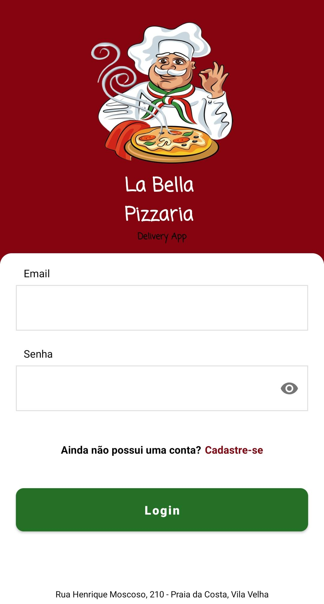
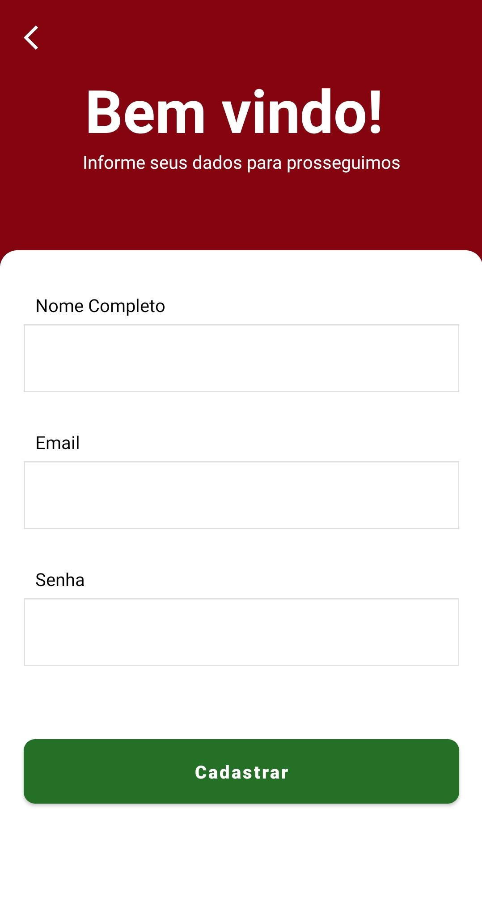
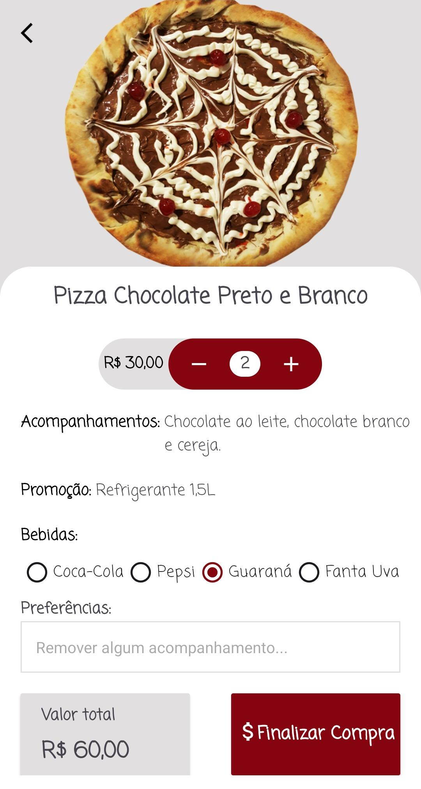
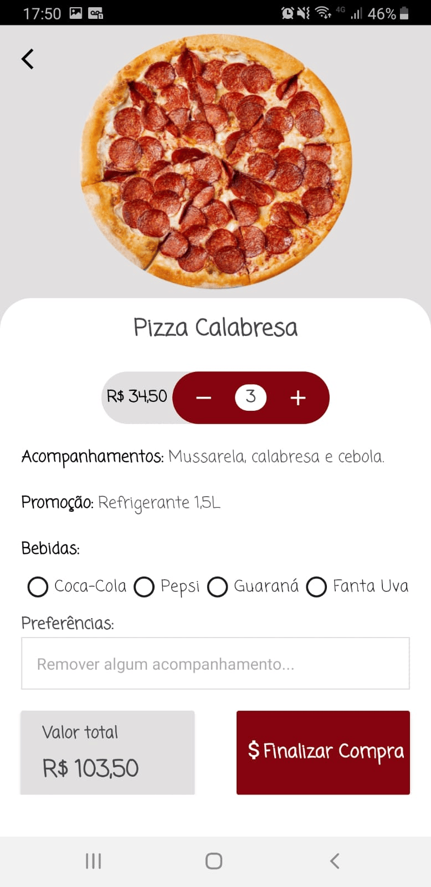
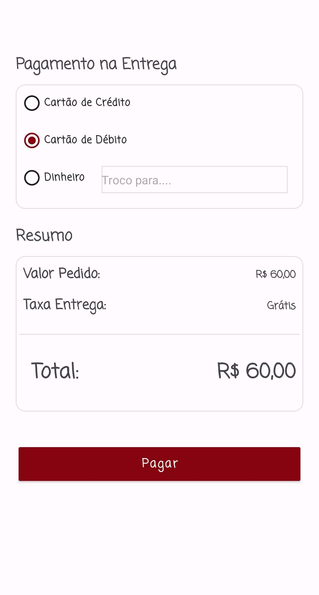
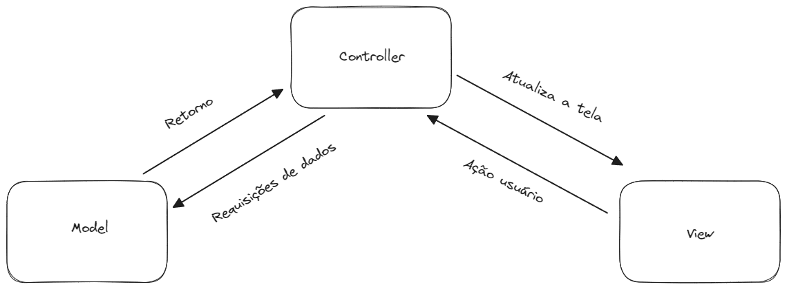
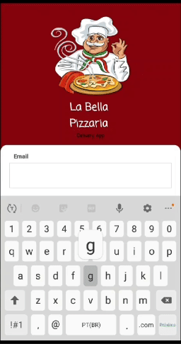
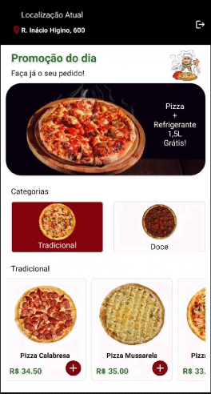
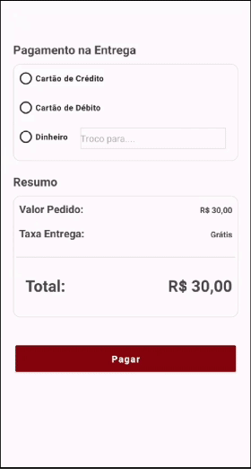
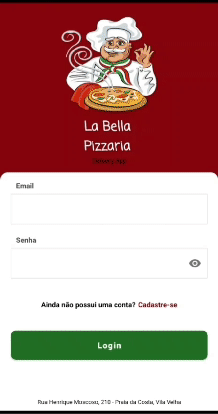

<h1 align="center">DELIVERY APP</h1>

<p align="center">
  <a href="https://opensource.org/licenses/Apache-2.0"></a>
  <a href="https://android-arsenal.com/api?level=24"></a>
  <br>
  <a href="https://wa.me/+5527998754853"></a>
  <a href="https://www.linkedin.com/in/guilherme-martins-032861251/"></a>
  <a href="mailto:guihroch@gmail.com"></a>
</p>

<p align="center">  

 💻  Projeto criado para demonstrar meu conhecimento técnico no desenvolvimento Android nativo com Kotlin.  

🍕 Aplicativo de Delivery personalizado, contendo UI simples para favorecer uma melhor experiência para o usuário. O App simula um aplicativo de pizzaria local, onde o usuário pode optar por diversas opções de sabores. Contém a pagina principal com todos os sabores disponíveis, tela de detalhes e tela de pagamento. 

</p>
 
</br>

<p float="left" align="center">

  
  
  
   

</p>


## Tecnologias usadas e bibliotecas de código aberto

- Minimum SDK level: 24
- [Linguagem Kotlin](https://kotlinlang.org/).

- Jetpack 
  - Lifecycle: Observa os ciclos de vida do Android e manipula os estados da interface do usuário após as alterações do ciclo de vida.
  - RecyclerView: Permite a criação de listas dinâmicas através do reaproveitamento de itens presentes na mesma, melhorando o desempenho do app.
  - ViewBinding: Liga os componentes do XML no Kotlin através de uma classe que garante segurança de tipo e outras vantagens.
  - Custom Views: View customizadas utilizando o XML.
  - Material Design Components: Permite a criação de uma interface de usuário utilizando diversos componentes interativos e personalizáveis.
  - ConstraintLayout: Permite a criação de layouts complexos sem a necessidade de uma hierarquia de visualização aninhada.
  
- Bibliotecas
  - [Firebase Authentication](https://firebase.google.com/docs/auth?hl=pt): O Firebase Authentication é um serviço de back-end projetado para simplificar o processo de autenticação de usuários.
  - [Lottie](https://developers.lottiefiles.com/): Lottie é uma biblioteca que renderiza animações em tempo real, permitindo que os aplicativos usem animações com a mesma facilidade com que usam imagens estáticas.


## Arquitetura
****Delivery App**** utiliza a arquitetura MVC (Model - View - Controller) que é um padrão de projeto de software que separa a interface do usuário (View) e das regras de negócio e dados (Model) usando um mediador (Controller) para conectar o modelo à view. 
</br></br>

<br>
<br>


## Features

### Tela de Login


Na tela inicial o usuário deve realizar o processo de autenticação através do Firebase Authentication, caso ja possua cadastro.
Caso não seja cadastrado, ele poderá seguir para a tela de cadastro. Se o usuário digitar algum email ou senha inválido, ele 
será notificado por um Toast informando o erro. Caso a autenticação ocorra normalmente, o usuário será encaminhado para a pagina
principal do aplicativo, após alguns segundos.

### Tela Principal


Na Tela principal o usuário terá acesso a diversas opções de sabores, podendo alternar entre as pizzas tradicionais e doces, refletindo
diretamente nos sabores apresentados na tela. As opções de pizza são apresentadas através de uma RecyclerView no sentindo horizontal
permitindo a rolagem dos produtos de forma didática ao usuário. Ao clicar no botão com o simbolo de adicionar, o usuário é encaminhado para
a Tela de Detalhes, onde temos a atualização do valor total influênciado diretamente pela quantidade selecionada. Após selecionar uma bebida e clicar em
Finalizar Compra, o usuário é encaminhado para a Tela de Pagamento.

### Tela de Pagamento


Na Tela de Pagamento o usuário deve escolher a opção de pagamento que será realizada na entrada. Caso seja pago em dinheiro, é obrigatório informar o valor para troco.
Após selecionada a forma de pagamento o usuário deve clicar em "Pagar" para finalizar o pedido, onde será simulado uma requisição para validar o pedido realizado
e após alguns segundos, será encaminhado para uma nova tela com animação, informando que o pedido foi realizado com sucesso, retornando a Tela Principal automaticamente.
No canto superior direito está presente o icone de logout, ao clicar será exibida uma Alert Dialog, onde o usuário pode escolher se desconectar do aplicativo.

### Tela de Cadastro


Na Tela de Cadastro o usuário deve fornecer os dados exigidos, caso deixe algum espaço em branco, utilize um email no formato inválido ou email ja existente, ou digite
uma senha com menos de 6 caracteres, ele será alertado através do HelperText, exibindo uma mensagem específica para cada erro citado. Caso forneça todos os dados corretamente
o usuário aguardará brevemente o processo de cadastro através do carregamento de uma ProgressBar e em seguida receberá um Toast informando que o cadastro foi realizado.

# Licença

```
        Copyright [2023] [Guilherme Henrique Martins Rocha]

   Licensed under the Apache License, Version 2.0 (the "License");
   you may not use this file except in compliance with the License.
   You may obtain a copy of the License at

     http://www.apache.org/licenses/LICENSE-2.0

   Unless required by applicable law or agreed to in writing, software
   distributed under the License is distributed on an "AS IS" BASIS,
   WITHOUT WARRANTIES OR CONDITIONS OF ANY KIND, either express or implied.
   See the License for the specific language governing permissions and
   limitations under the License.
```
