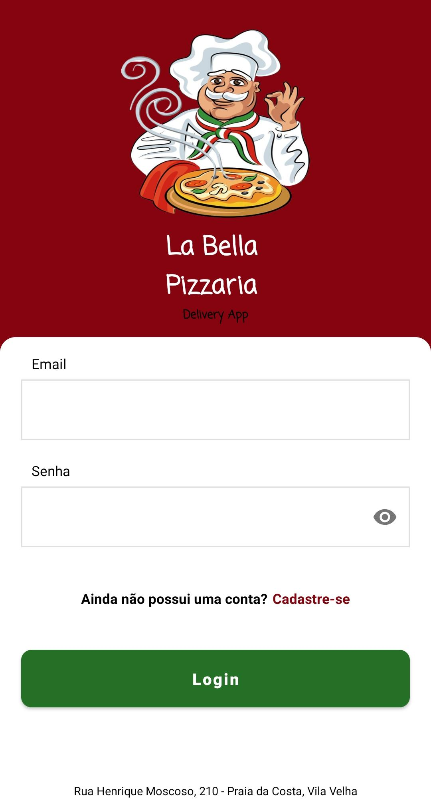
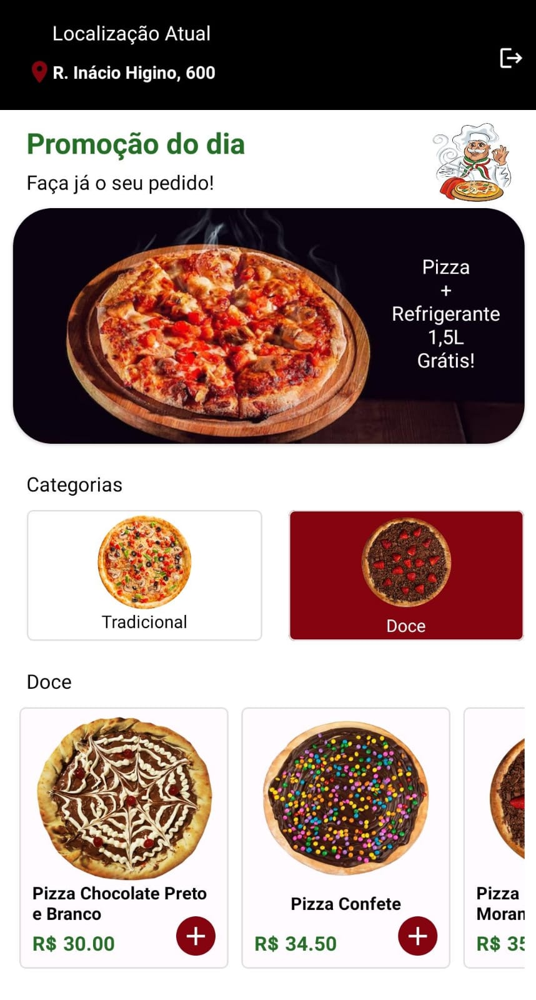
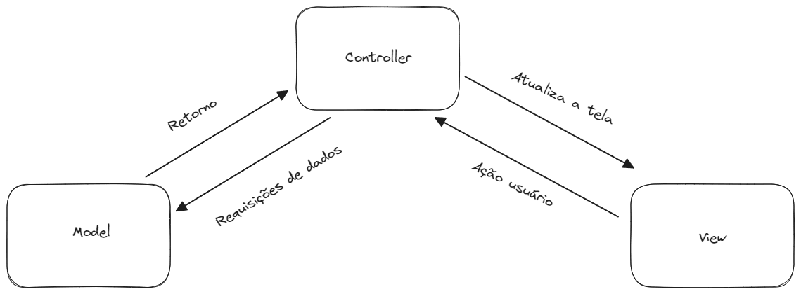
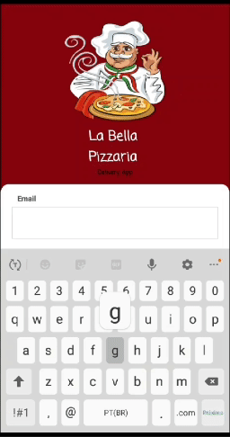
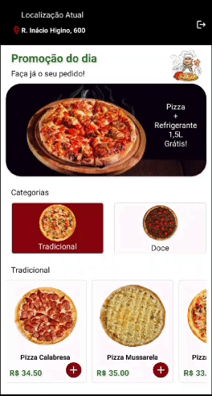
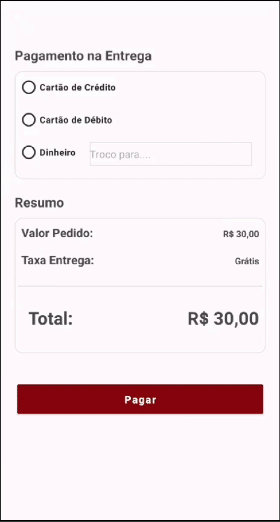
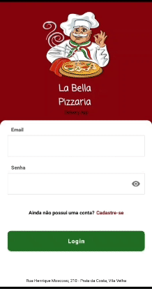

<h1 align="center">DELIVERY APP</h1>

<p align="center">
  <a href="https://opensource.org/licenses/Apache-2.0"></a>
  <a href="https://android-arsenal.com/api?level=24"></a>
  <br>
  <a href="https://wa.me/+5527998754853"></a>
  <a href="https://www.linkedin.com/in/guilherme-martins-032861251/"></a>
  <a href="mailto:guihroch@gmail.com"></a>
</p>

<p align="center">  

 💻  Projeto criado para demonstrar meu conhecimento técnico no desenvolvimento Android nativo com Kotlin. Mais informações técnicas abaixo. 

🍕 Aplicativo de Delivery personalizado, contendo UI simples para favorecer uma melhor experiência para o usuário. O App simula um aplicativo de pizzaria local, onde o usuário pode optar por diversas opções de sabores. Contém a pagina principal com todos os sabores disponíveis, tela de detalhes e tela de pagamento. 

</p>
 
</br>

<p float="left" align="center">

  
  
  
   

</p>

## Download
BADGE DA PLAYSTORE https://play.google.com/intl/en_us/badges/

Ou faça o download da <a href="apk/app-debug.apk?raw=true">APK diretamente</a>. Você pode ver <a href="https://www.google.com/search?q=como+instalar+um+apk+no+android">aqui</a> como instalar uma APK no seu aparelho android.

## Tecnologias usadas e bibliotecas de código aberto

- Minimum SDK level: 24
- [Linguagem Kotlin](https://kotlinlang.org/).

- Jetpack 
  - Lifecycle: Observa os ciclos de vida do Android e manipula os estados da interface do usuário após as alterações do ciclo de vida.
  - RecyclerView: Permite a criação de listas dinâmicas através do reaproveitamento de itens presentes na mesma, melhorando o desempenho do app.
  - ViewBinding: Liga os componentes do XML no Kotlin através de uma classe que garante segurança de tipo e outras vantagens.
  - Custom Views: View customizadas utilizando o XML.
  - Material Design Components: Permite a criação de uma interface de usuário utilizando diversos componentes interativos e personalizáveis.
  - ConstraintLayout: Permite a criação de layouts complexos sem a necessidade de uma hierarquia de visualização aninhada.
  
- Bibliotecas
  - [Firebase Authentication](https://firebase.google.com/docs/auth?hl=pt): O Firebase Authentication é um serviço de back-end projetado para simplificar o processo de autenticação de usuários.


## Arquitetura
****Delivery App**** utiliza a arquitetura MVC (Model - View - Controller) que é um padrão de projeto de software que separa a interface do usuário (View) e das regras de negócio e dados (Model) usando um mediador (Controller) para conectar o modelo à view. 
</br></br>

<br>
<br>


## Features

### Feature 1


Texto de exemplo

### Feature 2


### Feature 3


### Feature 4



# Licença

COLOQUE A LICENÇA - https://opensource.org/licenses

```
        Copyright [2023] [Guilherme Henrique Martins Rocha]

   Licensed under the Apache License, Version 2.0 (the "License");
   you may not use this file except in compliance with the License.
   You may obtain a copy of the License at

     http://www.apache.org/licenses/LICENSE-2.0

   Unless required by applicable law or agreed to in writing, software
   distributed under the License is distributed on an "AS IS" BASIS,
   WITHOUT WARRANTIES OR CONDITIONS OF ANY KIND, either express or implied.
   See the License for the specific language governing permissions and
   limitations under the License.
```
